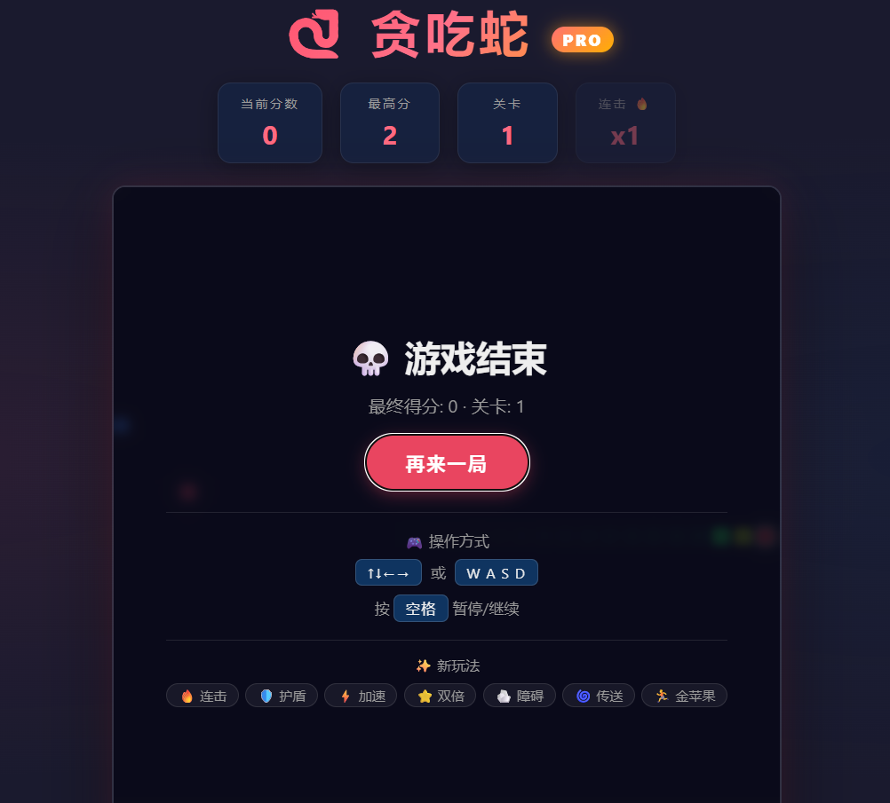
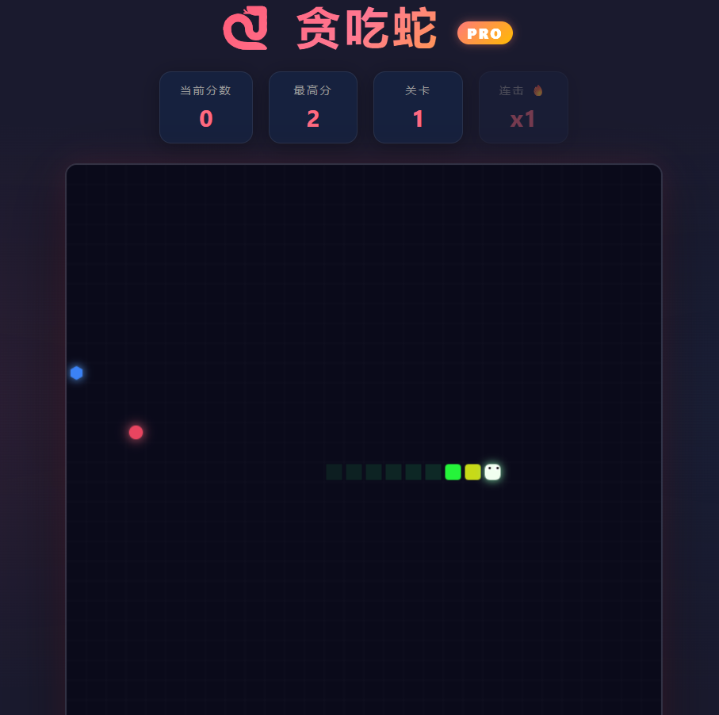

# 🐍 贪吃蛇 Pro

一个基于 HTML5 Canvas 的创新贪吃蛇游戏，在经典玩法上加入了连击、道具、障碍、传送门等丰富机制。

## 📸 游戏截图

<p align="center">
  
  &nbsp;&nbsp;
  
</p>

## 🎮 快速开始

直接用浏览器打开 `index.html` 即可游玩，无需安装任何依赖。

```bash
git clone git@github.com:huifeng-shuqing/snake-name.git
cd snake-name
# 双击 index.html 或在浏览器中打开
```

## 🕹️ 操作方式

| 按键 | 功能 |
|------|------|
| `↑ ↓ ← →` 或 `W A S D` | 控制蛇的方向 |
| `空格` | 暂停 / 继续 |
| 底部按钮 | 重新开始 / 暂停 |

## ✨ 特色玩法

### 🔥 连击系统
- **2 秒内**连续吃食物触发连击
- 得分倍率 = `1 + 连击数 × 0.5`
- 屏幕浮动显示 "+N 🔥xM" 文字
- HUD 实时显示当前连击数
- 连击越高，蛇身彩虹流转越快 🌈

### 🎒 道具系统
地图上随机出现三种道具（蓝/黄/紫色几何图形），拾取即生效：

| 道具 | 图标 | 效果 | 持续时间 |
|------|------|------|----------|
| 护盾 | 🛡️ | 抵消一次致命碰撞 | 直到消耗 |
| 加速 | ⚡ | 速度提升 30% | 8 秒 |
| 双倍 | ⭐ | 所有得分 ×2 | 10 秒 |

- 道具生成概率随关卡递增
- 道具 12 秒不捡会消失（闪烁提示）
- 多个道具效果可同时叠加

### 🪨 障碍石
- 等级 ≥3 时出现
- 每级生成 `等级/2` 块石头（最多 15 块）
- 撞到石头 = 游戏结束（护盾可抵挡一次）
- 每次升级时重新生成布局

### 🌀 传送门
- 等级 ≥5 时成对出现（青色漩涡）
- 蛇头进入一端 → 从另一端穿出，保持方向
- 穿越后 3 秒冷却（传送门变暗）
- 产生粒子爆裂特效

### 🏃 移动金苹果
- 等级 ≥4 时随机出现（金色旋转五星）
- 每 4 帧移动 1 格，会躲避你
- 价值 **5 分** + 必掉落一个道具
- 10 秒不抓会消失

### 📳 屏幕震动
- 游戏结束：强烈震动
- 关卡升级：轻微震动

### 🌈 彩虹蛇身
- 蛇身颜色基于 HSL 色相渐变
- 连击时色相流转加速，流光溢彩
- 头部保持亮色便于识别方向
- 护盾激活时蛇头蓝色光环

## 📊 计分规则

| 食物 | 基础分 | 特殊效果 |
|------|--------|----------|
| 🔴 普通食物 | 1 分 | - |
| ⭐ 特殊食物 | 3 分 | 每 5 分 30% 概率出现，闪烁倒计时 |
| 🏃 金苹果 | 5 分 | 会移动，必掉道具 |

**最终得分 = 基础分 × 连击倍率 × 双倍道具倍率**

每 10 分升一关，速度随关卡递增。

## 🏗️ 技术栈

- HTML5 Canvas
- 原生 JavaScript (ES6+)
- CSS3 动画
- 零依赖

## 📁 项目结构

```
snake-name/
├── index.html    # 游戏页面
├── game.js       # 核心游戏逻辑
├── style.css     # 样式表
├── 1.png         # 游戏截图 1
├── 2.png         # 游戏截图 2
└── README.md     # 本文件
```

## 🔮 未来计划

- [ ] 移动端触控支持
- [ ] 多种蛇皮/主题
- [ ] 排行榜系统
- [ ] Web Audio 音效
- [ ] 双人对战模式

## 📄 License

MIT
